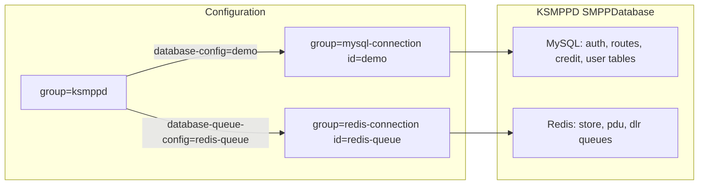

# Redis Queue Support for KSMPPD (Hybrid with MySQL)

## Goal

Enable KSMPPD to use **MySQL for relational data** (auth, routes, users, billing, schema) and **Redis for high-throughput queue storage** (message store, PDU queue, DLR queue), with **independent connection groups** — mirroring how [kannel/addons/sqlbox/gw/sqlbox_redis.c](file:///Users/sankar/work/gateway/kannel/addons/sqlbox/gw/sqlbox_redis.c) uses `redis-connection` via Kannel's `dbpool`.



## Current Architecture (unchanged call sites)

All queue I/O already flows through the `SMPPDatabase` vtable in [smpp/libsmpp/smpp_database.h](file:///Users/sankar/work/gateway/ksmppd/smpp/libsmpp/smpp_database.h). Call sites in [smpp_esme.c](file:///Users/sankar/work/gateway/ksmppd/smpp/libsmpp/smpp_esme.c), [smpp_bearerbox.c](file:///Users/sankar/work/gateway/ksmppd/smpp/libsmpp/smpp_bearerbox.c), and [smpp_queues.c](file:///Users/sankar/work/gateway/ksmppd/smpp/libsmpp/smpp_queues.c) use wrappers like `smpp_database_add_message()` — **no changes needed there**.

| Operation | Stays on MySQL | Moves to Redis (when configured) |
|-----------|---------------|----------------------------------|
| `authenticate`, `deduct_credit` | yes | — |
| `get_routes` | yes | — |
| `add_message`, `get_stored`, `delete` | default | yes |
| `add_pdu`, `get_stored_pdu` | default | yes |
| `get_dlrs`, `delete_dlr` | default | yes |
| `get_esmes_with_queued` | default | yes |

## Configuration

Add two directives to [smpp/libsmpp/smpp_server_cfg.def](file:///Users/sankar/work/gateway/ksmppd/smpp/libsmpp/smpp_server_cfg.def) and load them in [smpp_server.c](file:///Users/sankar/work/gateway/ksmppd/smpp/libsmpp/smpp_server.c):

| Directive | Values | Purpose |
|-----------|--------|---------|
| `database-queue-type` | `redis` (optional) | When set, queue ops use Redis; omit to keep all ops on MySQL |
| `database-queue-config` | id string | Links to `group=redis-connection` (same pattern as sqlbox `id`) |

Optional (sqlbox parity):

| Directive | Purpose |
|-----------|---------|
| `database-queue-inflight-table` | Redis list key suffix for `BRPOPLPUSH` reliable dequeue |

Example config:

```ini
group=ksmppd
database-type=mysql
database-config=demo
database-queue-type=redis
database-queue-config=redis-queue
database-enable-queue=true
database-store-primary=true

group=mysql-connection
id=demo
host=localhost
username=...
password=...
database=ksmppd

group=redis-connection
id=redis-queue
host=127.0.0.1
port=6379
database=0
max-connections=5
```

Existing table-name directives (`database-store-table`, `database-pdu-table`, `database-dlr-table`) become **Redis list key prefixes** when queue-type is redis.

## Implementation Design

### 1. Extend `SMPPDatabase` and `SMPPServer`

In [smpp_database.h](file:///Users/sankar/work/gateway/ksmppd/smpp/libsmpp/smpp_database.h) / [smpp_server.h](file:///Users/sankar/work/gateway/ksmppd/smpp/libsmpp/smpp_server.h):

- Add `void *queue_context` — Redis `DBPool*` when hybrid mode active
- Add `Octstr *database_queue_type`, `Octstr *database_queue_config`, `Octstr *database_queue_inflight_table` on `SMPPServer`

### 2. New file: `smpp_database_redis.c`

Implement Redis queue backend (~600–800 lines), modeled on sqlbox:

- **Init** (`smpp_database_redis_queue_attach`): scan `redis-connection` groups for matching `database-queue-config` id; `dbpool_create(DBPOOL_REDIS, ...)` — same as [sqlbox_init_redis](file:///Users/sankar/work/gateway/kannel/addons/sqlbox/gw/sqlbox_redis.c)
- **Hiredis I/O**: `dbpool_conn_consume` / `redisCommand` / `dbpool_conn_produce` (sqlbox pattern, not generic dbpool select)
- **Dequeue**: `LPOP {key} {count}` for batch fetch (not sqlbox's `LRANGE`+`LTRIM`); define command templates in `smpp_database_redis.h` e.g. `#define SMPP_REDIS_QUEUE_POP "LPOP %S %ld"`
- **JSON**: Jansson for serialize/deserialize (reuse field mapping from sqlbox's `redis_create_msg` / `redis_save_msg_create`)
- **URL encode/decode**: extract shared helpers from [smpp_database_mysql.c](file:///Users/sankar/work/gateway/ksmppd/smpp/libsmpp/smpp_database_mysql.c) into `smpp_database_util.c` (used by both backends)

### 3. Redis Key Schema

Use Redis **lists** (sqlbox style) with **INCR** for `global_id`:

| Key pattern | Type | Operations |
|-------------|------|------------|
| `{store_table}:id` | string (INCR) | auto-increment global_id |
| `{store_table}:{service}:{sms_type}` | list | LPUSH add, `LPOP key count` fetch batch |
| `{store_table}:esmes` | set | SADD/SREM on add/remove; SMEMBERS for poll index |
| `{pdu_table}:{system_id}` | list | LPUSH / `LPOP key count` |
| `{pdu_table}:esmes` | set | ESMEs with pending PDUs |
| `{dlr_table}:{service}` | list | LPUSH (external insert), `LPOP key count` fetch |
| `{dlr_table}:esmes` | set | ESMEs with pending DLRs |
| `{inflight_table}` (optional) | list | BRPOPLPUSH staging |

**Fetch pattern** — use **`LPOP key count`** (Redis 6.2+, atomic multi-pop) instead of sqlbox's `LRANGE` + `LTRIM`:

- `get_stored` / `get_stored_pdu` / `get_dlrs`: single command `LPOP {list_key} {limit}` (cap at `SMPP_DATABASE_BATCH_LIMIT`)
- Items are **removed from the list on fetch** (claim semantics); hold JSON + metadata in existing `pending_msg` / `pending_pdu` dicts until delivery completes
- Skip re-fetching: entries already in pending dicts are in-memory only (not back in Redis)
- **`delete` / `delete_dlr`**: remove from pending dict + update esme index sets — **no `LREM`** needed since item was popped on fetch
- **Failed delivery / requeue**: if ksmppd must put a claimed item back, `LPUSH` the stored JSON to the original list key (mirror MySQL requeue behaviour in bearerbox path)
- Verify Redis version at connect (`INFO server` ≥ 6.2) or panic with a clear message

**Enqueue/dequeue direction**: `LPUSH` on add + `LPOP` on fetch = LIFO per list key. Per-service/per-type key partitioning keeps ordering scoped the same way MySQL `LIMIT` batches do today.

**DLR JSON envelope** (for external producers in store-primary mode):

```json
{"global_id":0,"message_id":"...","service":"esme1","status":"DELIVRD",
 "err_code":0,"submit_date":"...","done_date":"...",
 "destination_addr":"...","source_addr":"...","smsc_id":"...","text":"..."}
```

External systems `LPUSH` to `{dlr_table}:{service}`; ksmppd assigns `global_id` via INCR if missing on insert.

### 4. Wire-up in MySQL init path

In `smpp_database_mysql_init()` ([smpp_database_mysql.c](file:///Users/sankar/work/gateway/ksmppd/smpp/libsmpp/smpp_database_mysql.c)):

1. Initialize MySQL pool and relational function pointers as today
2. If `database-queue-type=redis`, call `smpp_database_redis_queue_attach()` which:
   - Creates Redis pool
   - **Overrides** queue vtable pointers: `add_message`, `get_stored`, `delete`, `add_pdu`, `get_stored_pdu`, `get_dlrs`, `delete_dlr`, `get_esmes_with_queued`
   - Sets `queue_context`
3. Pass a flag into `smpp_database_mysql_init_tables()` to **skip** CREATE TABLE for store/pdu/dlr when Redis queue is active (still create user, route, version tables)

In `smpp_database_mysql_shutdown()`: also destroy Redis pool if `queue_context` is set.

Guard all Redis code with `#ifdef HAVE_REDIS` from Kannel's `gw-config --cflags`; panic with clear message if `database-queue-type=redis` but Kannel was not built with `--with-redis`.

### 5. Build system

[configure.ac](file:///Users/sankar/work/gateway/ksmppd/configure.ac):

- Add `PKG_CHECK_MODULES([jansson], [jansson >= 2.0])` (required when Redis queue enabled; sqlbox same dependency)
- Optionally probe `gw-config --cflags` for `HAVE_REDIS`

[smpp/Makefile.am](file:///Users/sankar/work/gateway/ksmppd/smpp/Makefile.am):

- Add `smpp_database_redis.c`, `smpp_database_util.c`
- Append `${jansson_LIBS}` / `${jansson_CFLAGS}` to `libsmpp_la_LDFLAGS`

[Dockerfile](file:///Users/sankar/work/gateway/ksmppd/Dockerfile): add `libjansson-dev` to builder stage (runtime libjansson4 if dynamically linked).

### 6. Documentation and examples

- New example: `example-configurations/mysql-auth-redis-queue/ksmppd.conf`
- New schema doc: `database-schemas/redis/keys.md` describing key layout and sample `redis-cli LPUSH` commands for DLR injection
- Brief README section on hybrid mode and Kannel build requirement (`--with-redis`)

## Files to Create/Modify

| File | Action |
|------|--------|
| `smpp/libsmpp/smpp_database_redis.c` | **Create** — Redis queue backend |
| `smpp/libsmpp/smpp_database_redis.h` | **Create** — Redis command macros, attach API |
| `smpp/libsmpp/smpp_database_util.c` | **Create** — shared URL encode/decode |
| `smpp/libsmpp/smpp_database.h` | Add `queue_context`, redis attach decl |
| `smpp/libsmpp/smpp_database_mysql.c` | Skip queue tables; call redis attach; shutdown both pools |
| `smpp/libsmpp/smpp_server.c` | Load new config directives |
| `smpp/libsmpp/smpp_server.h` | New config fields |
| `smpp/libsmpp/smpp_server_cfg.def` | New config keys |
| `smpp/Makefile.am` | New sources + jansson |
| `configure.ac` | Jansson check |
| `Dockerfile` | libjansson-dev |
| `example-configurations/mysql-auth-redis-queue/` | Example config |
| `database-schemas/redis/keys.md` | Redis key reference |

## Testing Plan

1. Build Kannel with `--with-redis`; build ksmppd with jansson
2. **MySQL-only regression**: existing configs unchanged when `database-queue-type` omitted
3. **Hybrid smoke test**:
   - ESME bind auth via MySQL `smpp_user`
   - Route lookup via MySQL `smpp_route`
   - Submit with `database-store-primary=true` → message lands in Redis list (verify via `redis-cli LLEN` before fetch, then confirm `LPOP` drains it on delivery)
   - ESME reconnect → message delivered from Redis queue
4. **DLR path**: `LPUSH` DLR JSON to Redis → ksmppd delivers to ESME → entry removed/marked
5. **PDU queue**: routing failure with `database-enable-queue` → PDU in Redis → replay on reconnect

## Risks and Mitigations

- **No SQL-style filtering on Redis lists**: mitigated by per-service/per-type key partitioning (matches ksmppd's query patterns)
- **LPOP claim vs MySQL SELECT-then-DELETE**: popped items live only in pending dict until ack; requeue path must `LPUSH` back on failure
- **Redis 6.2+ required** for `LPOP count`; check at startup via `INFO`
- **Jansson + hiredis deps**: align with sqlbox; Dockerfile already has hiredis
