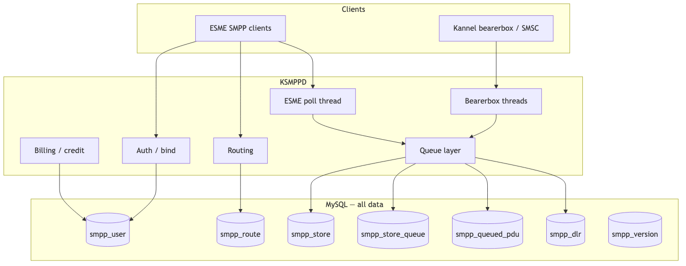
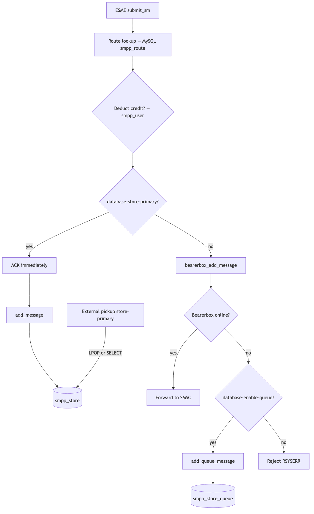
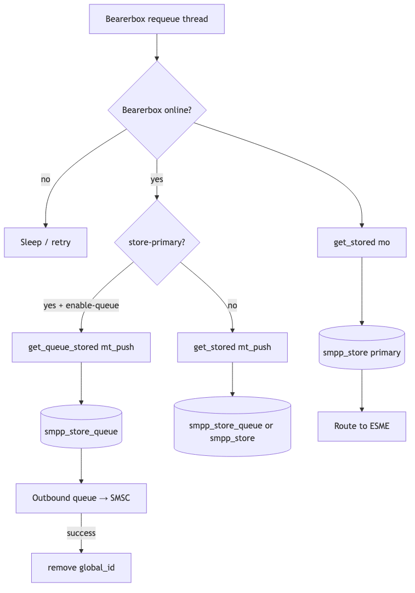
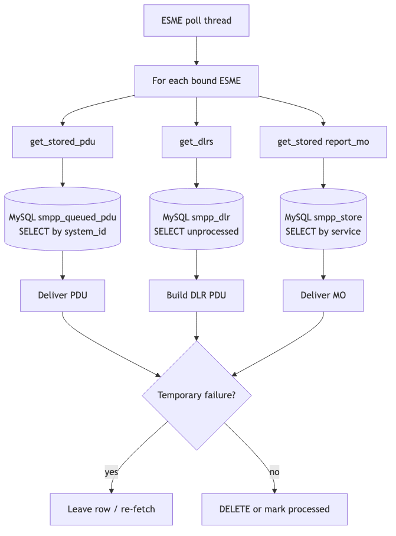
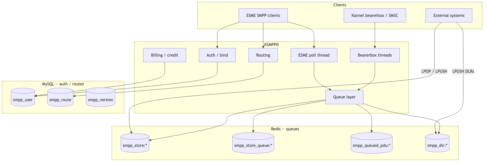
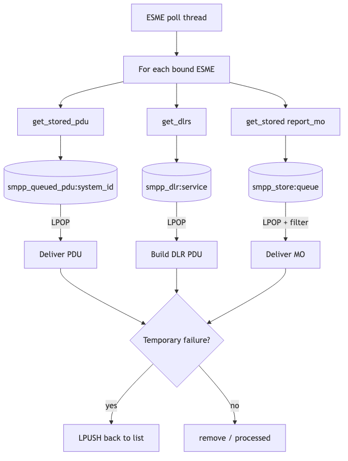
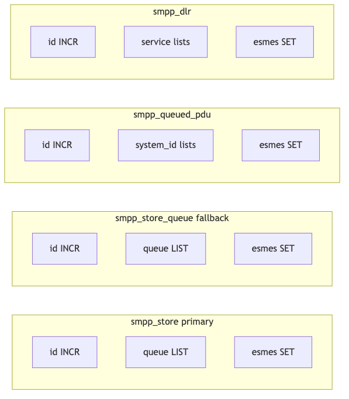
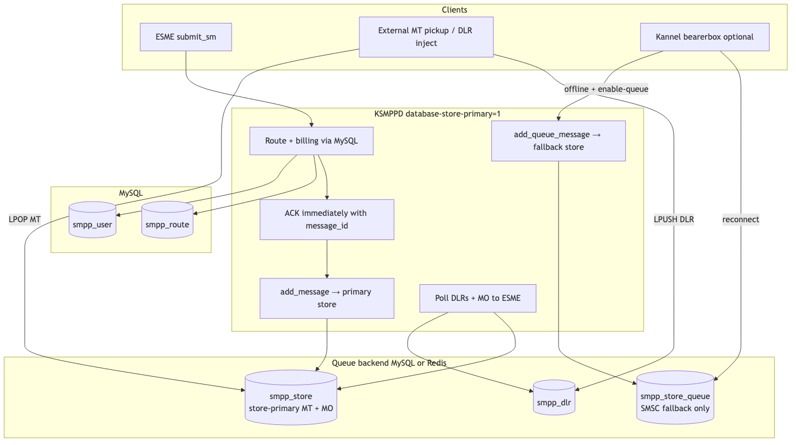
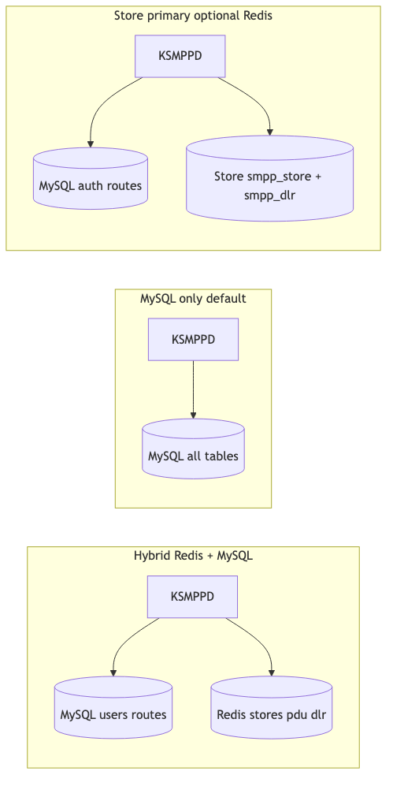

# KSMPPD database flows

Architecture and message-flow diagrams for KSMPPD database modes.

| Mode | Config | Doc section |
|------|--------|-------------|
| MySQL only (default) | `database-type=mysql` | [MySQL only](#mysql-only) |
| PostgreSQL | `database-type=postgres` | [PostgreSQL](#postgresql) |
| MySQL + Redis hybrid | `database-queue-type=redis` | [MySQL + Redis hybrid](#mysql--redis-hybrid) |
| Store primary | `database-store-primary=1` | [Database store primary](#database-store-primary) |

See also: [MySQL tables](../database-schemas/mysql/tables.sql), [PostgreSQL tables](../database-schemas/postgres/tables.sql), [Redis keys](../database-schemas/redis/keys.md).

---

## MySQL only

Default mode: all auth, routing, queues, and stores live in MySQL.

```ini
database-type=mysql
database-config=demo
database-enable-queue=1
```

Example: [example-configurations/database-only/](../example-configurations/database-only/)

### Architecture



| Data | MySQL table |
|------|-------------|
| Auth, users, credit | `smpp_user` |
| Routes | `smpp_route` |
| Store-primary MT, MO | `smpp_store` |
| Bearerbox fallback MT | `smpp_store_queue` |
| Queued PDUs | `smpp_queued_pdu` |
| DLRs | `smpp_dlr` |
| Schema version | `smpp_version` |

### Outbound MT (`submit_sm`)



Without `database-store-primary=1`, MT goes to bearerbox. If bearerbox is offline and `database-enable-queue=1`, messages are inserted into `smpp_store_queue`.

### Bearerbox reconnect



When bearerbox comes back online, the requeue thread drains `smpp_store_queue` (or `smpp_store` in legacy non-store-primary mode).

### ESME poll (inbound delivery)



Poll thread uses SQL `SELECT` on `smpp_queued_pdu`, `smpp_dlr`, and `smpp_store`. Failed temporary delivery leaves rows in place for retry.

---

## PostgreSQL

Use PostgreSQL for auth, routing, and (optionally) queue tables. Kannel must be built with `--with-pgsql`.

```ini
database-type=postgres
database-config=demo
database-enable-queue=1
```

Example: [example-configurations/postgres-auth/](../example-configurations/postgres-auth/)

Connection group (Kannel standard):

```ini
group=pgsql-connection
id=demo
host=localhost
port=5432
username=ksmppd
password=ksmppdpass
database=ksmppd
max-connections=5
```

`database-type` also accepts `postgresql` or `pgsql`.

Schema: [database-schemas/postgres/tables.sql](../database-schemas/postgres/tables.sql). Requires the **pgcrypto** extension for SHA-256 password hashes (`encode(digest(password, 'sha256'), 'hex')`), matching MySQL `SHA2(password, 256)`.

Combine with `database-queue-type=redis` the same way as MySQL — PostgreSQL holds users/routes; Redis holds queues.


*(Diagram structure is the same as MySQL-only; substitute PostgreSQL for the database box.)*

---

## MySQL + Redis hybrid

Queue data in Redis; auth and routing stay in MySQL.

```ini
database-type=mysql
database-config=demo
database-queue-type=redis
database-queue-config=redis-queue
database-enable-queue=1
```

Example: [example-configurations/mysql-auth-redis-queue/](../example-configurations/mysql-auth-redis-queue/)

Requires Redis **6.2+** (`LPOP key count`).

### Architecture



| Data | Backend | Config / Redis prefix |
|------|---------|------------------------|
| Auth, users, credit | MySQL | `database-config` |
| Routes | MySQL | `database-config` |
| Store-primary MT, MO | Redis | `database-store-table` → `smpp_store` |
| Bearerbox fallback MT | Redis | `database-queue-store-table` → `smpp_store_queue` |
| Queued PDUs | Redis | `database-pdu-table` → `smpp_queued_pdu` |
| DLRs | Redis | `database-dlr-table` → `smpp_dlr` |

Startup: `smpp_database_mysql_init()` creates the MySQL pool, then `smpp_database_redis_queue_attach()` overrides queue vtable functions (`add_message`, `get_stored`, `add_pdu`, `get_dlrs`, etc.).

### ESME poll (Redis LPOP)



Items are claimed with `LPOP`. Temporary failures are requeued with `LPUSH`.

### Redis key layout



Full key definitions: [database-schemas/redis/keys.md](../database-schemas/redis/keys.md).

---

## Database store primary

MT is stored in the database (MySQL table or Redis list), ACK is sent immediately, and no bearerbox is required for delivery. External systems pick up MT from the primary store and inject DLRs.

```ini
database-type=mysql
database-config=demo
database-store-primary=1
database-enable-queue=1
database-store-table=smpp_store
database-queue-store-table=smpp_store_queue
database-dlr-table=smpp_dlr
```

Example: [example-configurations/database-store-primary/](../example-configurations/database-store-primary/)

Combine with `database-queue-type=redis` to use Redis for stores while keeping MySQL for auth/routes.

### Architecture



Two separate stores when bearerbox fallback is also enabled:

| Path | Store | Purpose |
|------|-------|---------|
| `add_message()` | `smpp_store` | Store-primary MT after submit_sm ACK; MO when ESME has no receivers |
| `add_queue_message()` | `smpp_store_queue` | MT queued while bearerbox/SMSC is offline |

External MT pickup: `LPOP smpp_store:queue` (Redis) or `SELECT` from `smpp_store` (MySQL).

External DLR injection: `LPUSH smpp_dlr:{service}` (Redis) or `INSERT INTO smpp_dlr` (MySQL).

### Outbound MT

Same [submit_sm flow](images/flow-submit-sm.png) — when `database-store-primary=1`, routing succeeds → immediate ACK → `add_message()` → primary store.

### Bearerbox fallback (optional)

If a bearerbox is configured and goes offline, fallback MT uses `smpp_store_queue` only. On reconnect, [bearerbox requeue](images/flow-bearerbox-requeue.png) drains that queue via `get_queue_stored()`.

---

## Backend comparison



The same `smpp_database_*` API is used in all modes; only the backend (MySQL tables vs Redis lists) changes.

---

## Source diagrams

Mermaid source files for all images are in [docs/images/](images/). Regenerate PNGs:

```bash
cd docs/images
for f in *.mmd; do
  npx @mermaid-js/mermaid-cli -i "$f" -o "${f%.mmd}.png" -b white -w 1400
done
```
